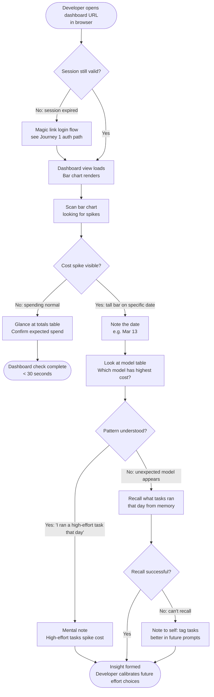

# UX Design Specification — OpenTalon

**Author:** Miao
**Date:** 2026-03-23

---

<!-- UX design content will be appended sequentially through collaborative workflow steps -->

## Executive Summary

### Project Vision

OpenTalon gives solo developers cost literacy over their agentic AI tool usage. The product has two UX surfaces with fundamentally different design languages: a terminal CLI (primary, daily-use) and a web dashboard (companion, periodic check-in). The terminal is where the core value moment — seeing token cost immediately after a task — must land with impact. The dashboard is where patterns become visible over time.

### Target Users

**The Budget-Conscious Solo Developer.** Technically proficient, lives in the terminal, self-hosts by preference, and is sensitive to unexpected AI API costs. They have zero patience for confusing flows and will notice poor CLI output formatting immediately. They check the dashboard every few days, not continuously — the mental model is "weekly review," not "live monitoring."

### Key Design Challenges

1. **The API key handoff ceremony.** During `opentaion login`, the user generates a key in the web dashboard then manually pastes it into the terminal. This cross-context handoff (browser → terminal) is the most friction-heavy moment in onboarding. The web UI must make it obvious which key to copy and the CLI must make it obvious where to paste it.

2. **Making the cost summary unmissable.** `✓ Task complete. Tokens: 3,800 | Cost: $0.0004` is the product's core value moment. If it disappears into terminal noise, the product fails. Color hierarchy and visual weight via the `rich` library must make this line stand out from code output.

3. **Chart legibility without visual complexity.** The 30-day usage chart must surface cost spikes at a glance. V1 uses a simple single-color bar chart (total tokens per day) — no stacked bars. Per-model breakdown lives in a data table below the chart, keeping the visualization clean and unambiguous.

### Design Opportunities

1. **Terminal output as product identity.** The `rich` library enables consistent color and layout. A well-designed cost summary (e.g., green accent for cost, dimmed for token counts) creates a recognizable product feel on every task completion.

2. **Magic link flow as trust moment.** The auth flow crosses two contexts (email → browser → terminal). The web confirmation page can reinforce the product's value: "You're authenticated. Your costs are now being tracked."

3. **Dashboard as a "check-in" surface.** No polling, no real-time updates. Design optimizes for quick pattern recognition on periodic visits — not live monitoring. The bar chart's job is to make a cost spike visible in under 3 seconds.

### Visual Design Constraints

- **CSS:** Raw Tailwind CSS utilities only — no shadcn/ui or other component libraries
- **Colors:** Neutral grays (`gray-50` through `gray-900`) + single accent (`blue-600`)
- **Dark mode:** Not in V1
- **Web layout (authenticated):** Two-panel — 220px fixed left sidebar + main content area
- **Sidebar navigation:** Conditional rendering to switch between "Dashboard" view and "API Keys" view — no router library

## Desired Emotional Response

### Primary Emotional Goals

**Primary:** Informed and in control — the developer understands what they spent, why, and what they'd do differently next time.

**Secondary:** Quietly confident — using OpenTalon makes the developer feel like a more deliberate, professional practitioner. Not just someone who runs AI tools and hopes for the best, but someone who manages their "thinking budget" consciously.

**The anti-goal:** Anxiety and regret. A cost display that triggers "I shouldn't have run that" or "I don't understand why it cost that much" has failed, regardless of the accuracy of the number.

### Emotional Journey Mapping

| Stage | Desired emotion | Design mechanism |
|---|---|---|
| First install + login | Curiosity → confidence | Frictionless onboarding; clear success confirmation in terminal |
| First task with cost display | Surprise → delight | Cost appears immediately, formatted cleanly; the number is smaller than expected |
| Daily `/effort` selection | Agency | The choice happens *before* the task; cost is outcome confirmation, not revelation |
| Cost spike discovery on dashboard | Alert → investigative → resolved | Chart makes the spike visible without alarm; no moralizing language |
| Proxy error | Momentary frustration → guided | Error message is specific and actionable; recovery path is obvious |
| Weekly dashboard check-in | Satisfaction + pattern recognition | Data is legible at a glance; behavioral insight is self-evident without narration |

### Micro-Emotions

**Cultivate:**
- **Confidence** — the developer trusts the cost number is accurate to the cent
- **Agency** — choosing an effort tier *before* running makes the cost feel owned, not imposed
- **Curiosity** — "I wonder what the high-tier model would have cost for that same task"
- **Satisfaction** — seeing a $0.0004 cost on a boilerplate task is quietly pleasing

**Avoid:**
- **Anxiety** — cost displayed in red, alarm-style formatting, or with implicit judgment
- **Regret** — post-task language that implies the user made a mistake ("Warning: this was expensive")
- **Confusion** — ambiguous cost format (is that per-call or total? tokens or dollars?)
- **Shame** — no moralizing commentary on high-cost days in the dashboard

### Design Implications

**"Informed" → Context before cost**
The `/effort` selection happens *before* execution. By the time the cost appears, the user has already set an intention. The cost confirms a choice rather than revealing a surprise. This is the most important emotional design decision in the entire product — the sequencing of intent → execution → result.

**"In control" → Neutral cost colors for normal costs**
Cost values display in a calm, neutral accent color (not red, not green for "good", not amber for "high"). Color-based judgment belongs nowhere in V1 — the developer determines what's appropriate for their task, not the UI.

**"Not anxious" → Consistent, parseable format**
`Tokens: 3,800 | Cost: $0.0004` — same format, every time, no exceptions. Predictable formatting removes cognitive overhead and prevents the mild panic of "wait, is that a lot?"

**"Not regretful" → Dashboard shows patterns, not mistakes**
The bar chart displays data without editorializing. No "⚠️ High spend day" labels. No color-coded "bad days." The developer draws their own conclusions from the data. The product's job is visibility, not judgment.

**"Quietly confident" → The terminal IS the product moment**
The cost summary line uses `rich` formatting: the checkmark (`✓`) is bold, the cost value uses the accent color, and the token count is dimmed. The visual hierarchy says: "you succeeded, and here's what it cost." Success first, cost second.

### Emotional Design Principles

1. **Anticipation beats revelation.** The effort tier is chosen before the task runs. Every cost display is the outcome of a deliberate choice, never a surprise.

2. **Data without judgment.** Numbers are neutral. The dashboard shows what happened; it does not editorialize about whether it was good or bad. The developer is the expert on their own work.

3. **Smallest possible emotional footprint for errors.** When the proxy is down, the CLI is honest and specific. It doesn't catastrophize. It says what's wrong and exits. The developer can fix it.

4. **Delight lives in the small number.** The most emotionally powerful moment in the product is seeing `Cost: $0.0002` after a task that would have cost $0.04 on a default expensive model. Don't over-design around it — just make sure it's visible.

## UX Pattern Analysis & Inspiration

### Inspiring Products Analysis

**Stripe CLI — API key management and terminal output**
The Stripe CLI defines the standard for developer-facing CLI auth flows. Its API key generation experience (generate → display once → explicit copy instruction) maps directly to the OpenTalon `opentaion login` ceremony. Its color use is surgical: only status-bearing output gets color; everything else is plain. Error messages are specific, never generic.

**GitHub CLI (`gh`) — Terminal typography**
The `gh` CLI is the benchmark for terminal output hierarchy. Bold for primary status, standard weight for content, dimmed (`dim`) for secondary metadata. `gh pr status` demonstrates exactly the treatment we want for the cost summary: the task result is primary, the cost value is accented, the token count is dimmed. The developer's eye lands on what matters without scanning.

**`uv` (Python package manager) — CLI speed and minimalism**
`uv` sets the expectation that a modern developer CLI should be fast and provide tight, purposeful output. No unnecessary verbosity. Progress is indicated just enough to show the system is working. Sets the benchmark for how OpenTalon's agent loop progress should feel.

**Plausible Analytics — Dashboard mental model**
Plausible is the closest product to OpenTalon's web dashboard. One page, one chart, one summary table, no real-time complexity, loads in under a second. Designed for the "weekly check-in" visit pattern, not continuous monitoring. The information hierarchy — chart first, table second — is exactly what we're implementing. Proof that a minimal dashboard can be a complete product.

**Linear — Two-panel sidebar layout**
Linear's two-panel layout (fixed sidebar navigation + main content area) is the reference for our authenticated dashboard structure. The sidebar is purposeful and narrow; it navigates, not decorates. The main area owns the page.

### Transferable UX Patterns

**Navigation:**
- Fixed 220px sidebar with 2 items ("Dashboard" / "API Keys") — adapted from Linear's sidebar discipline: narrow, purposeful, no decorative elements
- Active state via `bg-blue-50 text-blue-600` on the selected nav item — simple, clear, no animation needed

**Terminal output hierarchy (from `gh` CLI):**
- `bold white` — task success indicator (`✓ Task complete`)
- `blue-600 equivalent` — cost value (the number that matters)
- `dim/gray` — token count (supporting data, not primary)
- `red` reserved exclusively for errors — never for normal cost display

**Data visualization (from Plausible):**
- Single bar chart above the fold — no tabs, no date pickers
- Summary table below the chart — model name | tokens | cost
- Data loads once on page render — no spinner states to design around

**API key management (from Stripe CLI):**
- Key displayed once at creation with explicit "copy this now" instruction
- Listed with truncated preview (`ot_...abc123`) — never full key
- Simple revoke action — no confirmation modals in V1

### Anti-Patterns to Avoid

**AWS Cost Explorer pattern** — Complex date range pickers, overwhelming breakdowns by service/region/tag, multiple chart types. The opposite of our "informed and in control" goal. Every piece of complexity we add moves us toward this anti-pattern.

**Grafana dashboard pattern** — Real-time panels, multiple charts, threshold alerts, color-coded severity states. Built for ops teams watching live systems. Wrong mental model entirely for a solo developer periodic check-in.

**Generic error messages** — "Something went wrong. Please try again." tells the developer nothing. Every error in OpenTalon names the specific system that failed and what to do about it.

**Passive auth flows** — Asking users to "check their inbox" without telling them what they're looking for, or why. Magic link flows need explicit guidance at every handoff.

### Design Inspiration Strategy

**Adopt directly:**
- `gh` CLI output hierarchy (bold/standard/dim three-tier system) → cost summary line formatting
- Plausible dashboard layout (chart above, table below, load-once) → dashboard view
- Stripe key management flow (display once, truncated preview, revoke) → API keys view
- Linear sidebar discipline (narrow, purposeful, 2 items max) → authenticated layout

**Adapt:**
- Plausible's date-range filter → remove entirely (fixed 30 days in V1, no picker)
- Stripe's multi-environment key management → simplify to single list + revoke only
- Linear's sidebar icons → text-only labels (simpler to implement, sufficient at 2 items)

**Avoid entirely:**
- Any real-time update pattern
- Color-coded severity for cost values
- Complex chart interactions (tooltips are acceptable, drill-down is not)
- Confirmation modals (revoke is immediate in V1)

## Design System Foundation

### Design System Choice

**Raw Tailwind CSS v3 utilities — no component library.**

OpenTalon's web dashboard has two views and seven interactive elements. A component library would add installation complexity, opinionated styling to fight against, and per-component dependencies — all for a surface that can be fully implemented with Tailwind utility classes in less than 500 lines of JSX.

### Rationale for Selection

1. **Scope match.** A 2-view dashboard with one chart, one table, and one form does not need a component library. The overhead of setup exceeds the value of prebuilt components.

2. **Book constraint.** shadcn/ui requires an interactive CLI, TypeScript path alias changes, and per-component installation — each of which breaks the book's "single command, then code" teaching flow. Raw Tailwind has no such friction.

3. **Pedagogical value.** Building a `<Button>`, `<Sidebar>`, and `<DataTable>` from Tailwind utilities teaches the reader how component styling works. Importing a prebuilt component teaches nothing.

4. **Full visual control.** The Plausible Analytics aesthetic we're targeting is clean, minimal, and opinionated. A custom implementation guarantees we hit the exact look — no fighting against a library's defaults.

### Design Tokens

These are the only values used across the entire web surface. Nothing outside this set is permitted in V1.

**Color palette:**

| Token | Tailwind class | Use |
|---|---|---|
| Background | `bg-gray-50` | Page background |
| Surface | `bg-white` | Cards, sidebar, panels |
| Border | `border-gray-200` | All dividers and outlines |
| Text primary | `text-gray-900` | Headings, labels |
| Text secondary | `text-gray-500` | Subtext, metadata |
| Accent | `text-blue-600` / `bg-blue-600` | Active nav, buttons, chart fill |
| Accent subtle | `bg-blue-50` | Active nav background |
| Destructive | `text-red-600` | Revoke key action only |

**Typography:**

| Use | Classes |
|---|---|
| Page heading | `text-xl font-semibold text-gray-900` |
| Section heading | `text-sm font-medium text-gray-700 uppercase tracking-wide` |
| Body | `text-sm text-gray-900` |
| Secondary / metadata | `text-sm text-gray-500` |
| Monospace (key preview) | `font-mono text-xs text-gray-600` |

**Spacing:** 4px base unit (`p-4`, `gap-4`, `space-y-4`). Sidebar: `w-[220px]`. Content area: `flex-1 p-6`.

**Interactive states:** Buttons use `hover:bg-blue-700` / `hover:bg-gray-100`. Focus rings via `focus:outline-none focus:ring-2 focus:ring-blue-500`. No custom focus styles.

### Customization Strategy

No customization of Tailwind's default config in V1 — use the default scale directly. If a value is needed that doesn't exist in defaults (e.g., sidebar width `220px`), use an inline style or `w-[220px]` arbitrary value. Do not extend `tailwind.config.js` unless absolutely necessary.

## Core User Experience

### 2.1 Defining Experience

OpenTalon's defining experience is: **"Choose your effort tier, run a task, see what it cost."**

If there's one sentence that describes what users tell their colleagues about OpenTalon, it's: *"I always know exactly what my AI calls cost before I run them, and exactly what they cost after."* The defining interaction is the three-beat sequence of **intent → execution → confirmation**:

1. `/effort low` — the developer declares how much thinking this task needs
2. Task runs (agent loop, tool calls, context accumulation)
3. `✓ Task complete. Tokens: 3,800 | Cost: $0.0004` — the cost lands, confirming the choice

This is not a monitoring product. It is a **decision feedback loop**. Every successful use of OpenTalon trains the developer's intuition about what tasks cost at each effort tier. Over weeks, they stop guessing and start knowing.

### 2.2 User Mental Model

**How developers currently solve this problem:** They don't. They either ignore API costs until the billing email arrives, or they manually check the OpenRouter dashboard occasionally — a context switch that most developers skip. The mental model that developers bring is **post-hoc billing**: costs are discovered, not tracked.

**What OpenTalon replaces:** The billing surprise. The developer currently has no feedback loop between "running a task" and "seeing its cost." OpenTalon inserts a cost display at the exact moment when the developer is still thinking about the task — immediately after completion, in the same terminal session.

**Mental model OpenTalon creates:** **"Thinking budget."** Each effort tier is a spending tier. The developer builds an intuition about effort-tier costs the way a developer builds intuition about algorithm complexity: not by calculating, but by experiencing enough examples that the pattern becomes automatic.

**Where confusion lives:** The cross-context onboarding ceremony (`opentaion login`) is the highest-friction moment. The developer must generate an API key in the web dashboard and paste it into the terminal. This is a two-window operation that feels awkward if either side doesn't provide clear guidance. The CLI prompt and the web dashboard key-creation UI must be co-designed so the two halves form a single clear flow.

### 2.3 Success Criteria

The core experience succeeds when:

1. **The cost is unmissable.** The cost summary line stands out from surrounding terminal output without being loud. A developer scanning their terminal after a task should land on the cost number in under 2 seconds.

2. **The format is always parseable.** `Tokens: 3,800 | Cost: $0.0004` — the developer never needs to think "wait, is that per-call or total?" Same structure, every time.

3. **The cost feels owned, not imposed.** Because the effort tier was chosen before execution, the cost display feels like confirmation of a decision, not a judgment on behavior.

4. **Errors name what broke.** A proxy failure error is not "something went wrong." It names the failed component, the likely cause, and the fix.

5. **The web dashboard loads before the developer loses patience.** One fetch on render. No spinner states. Data is there or it isn't.

### 2.4 Novel vs. Established Patterns

**Established patterns adopted directly:**

- Terminal cost display format mirrors `gh pr status` output hierarchy: bold status line, accented key value, dimmed secondary data. Developers who use `gh` already have the scanning pattern loaded.
- Two-panel web layout (sidebar + content) is a known authenticated app pattern. No learning curve.
- API key management (generate → display once → truncated list → revoke) matches Stripe's established developer-tooling pattern.

**Novel pattern — effort-tier routing:**

The `/effort [low|medium|high]` pre-declaration is novel. No mainstream developer CLI has a deliberate "spend tier" concept. The UX challenge is making this feel like a natural declaration rather than an administrative burden. Design decisions that support this:

- The effort command is short (`/effort low`, not `opentaion set-effort-tier --level=low`)
- The tier names are semantically obvious — no codes, no numbers, no percentages
- Missing `/effort` is not an error; a default tier applies silently
- After the task, the cost summary confirms which tier was active: `Model: deepseek/deepseek-r1 (low)`

**Novel pattern — loop-level cost attribution:**

Standard API dashboards show cost per API call. OpenTalon shows cost per agent-loop task. This is a meaningful semantic difference — a single "fix the type errors in auth.py" task may make 8 LLM calls. The user thinks of this as one task. OpenTalon meters it as one task. This requires no special UI — it's implicit in the data model — but the cost summary line must reflect the aggregated cost, not any individual call.

### 2.5 Experience Mechanics

The six core interaction flows, from first install to weekly check-in:

---

**Flow 1 — First-Time CLI Onboarding (`opentaion login`)**

```
$ opentaion login

OpenTalon Setup
───────────────
  First, start your OpenTalon API server and grab its URL.
  Then, generate an API key from your dashboard.

  Proxy URL (e.g. https://your-api.railway.app): _

  [user types URL, presses Enter]

  OpenTalon API Key: _

  [user pastes key from dashboard, presses Enter]

✓ Connected to https://your-api.railway.app
✓ Configuration saved to ~/.opentaion/config.json

You're ready. Run: opentaion /effort low "your first task"
```

*Key decisions:*
- Two prompts, sequential, labeled exactly what to enter
- No URL validation beyond reachability check — don't over-engineer the CLI
- Success confirmation names the saved config file — developer knows where to look if something goes wrong
- Closing line is an invitation, not a manual

---

**Flow 2 — Daily Task Execution**

```
$ opentaion /effort low "add docstrings to utils.py"

  ◆ Model: deepseek/deepseek-r1 (low tier)
  ◆ Reading utils.py...
  ◆ Generating docstrings...
  ◆ Applying changes...

✓ Task complete.  Tokens: 3,800  |  Cost: $0.0004
```

*Key decisions:*
- Progress lines use `◆` bullet, dimmed — visible but not competing with the result
- Success line: bold `✓ Task complete.` is primary; `Cost: $0.0004` is blue-accented; `Tokens: 3,800` is dimmed
- No elapsed time shown — not the product's job
- No "what changed" summary — the diff is in the code; the cost is OpenTalon's contribution

---

**Flow 3 — Proxy Error State**

```
$ opentaion /effort medium "refactor the auth module"

  ◆ Model: meta-llama/llama-3.3-70b (medium tier)
  ◆ Reading auth module...

✗ Proxy unreachable: https://your-api.railway.app

  Could not connect to the OpenTalon API server.
  Check that your Railway deployment is running.

  Run `opentaion login` to update your proxy URL.
```

*Key decisions:*
- `✗` in red — the only place red appears in the CLI
- Error message names the exact URL that failed
- Specific cause hypothesis ("Check that your Railway deployment is running")
- Recovery path is one command — no ambiguity

---

**Flow 4 — Web: Unauthenticated State (Magic Link Login)**

```
┌─────────────────────────────────────────────────┐
│                                                 │
│              OpenTalon                          │
│                                                 │
│   Sign in to your dashboard                     │
│                                                 │
│   ┌─────────────────────────────────────┐       │
│   │  your@email.com                     │       │
│   └─────────────────────────────────────┘       │
│                                                 │
│   [  Send magic link  ]                         │
│                                                 │
│   ─────────────────────────────────────         │
│                                                 │
│   ✉  Check your email for a sign-in link.       │
│      The link expires in 10 minutes.            │
│                                                 │
└─────────────────────────────────────────────────┘
```

*Key decisions:*
- Single input, single action — no password field, no "confirm email"
- Post-send state replaces the button with a clear instruction
- 10-minute expiry is stated up front — developer knows what to expect

---

**Flow 5 — Web: Authenticated Dashboard View**

```
┌────────────┬────────────────────────────────────────────────┐
│            │                                                │
│ OpenTalon  │  Usage — Last 30 Days                          │
│            │                                                │
│ ● Dashboard│  ┌──────────────────────────────────────────┐  │
│  API Keys  │  │                    ▐█                    │  │
│            │  │              ▐█   ▐██  ▐█                │  │
│            │  │  ▐█  ▐█  ▐█  ▐██  ▐██  ▐██  ▐█           │  │
│            │  └──────────────────────────────────────────┘  │
│            │   Mar 1                              Mar 23     │
│            │                                                │
│            │  ──────────────────────────────────────────    │
│            │                                                │
│            │  Model                  Tokens      Cost       │
│            │  deepseek/deepseek-r1   124,400     $0.0124    │
│            │  meta-llama/llama-3.3   88,200      $0.0882    │
│            │  qwen/qwen-2.5-72b      31,100      $0.0311    │
│            │                                                │
│            │  Total                  243,700     $0.1317    │
│            │                                                │
└────────────┴────────────────────────────────────────────────┘
```

*Key decisions:*
- Sidebar: 220px fixed, two items, active state via `bg-blue-50 text-blue-600`
- Bar chart: single color (`bg-blue-600`), no legend, no date picker (fixed 30 days)
- Table: model name | tokens | cost — total row at bottom
- No real-time update — data loads once on page render

---

**Flow 6 — Web: API Keys View**

```
┌────────────┬────────────────────────────────────────────────┐
│            │                                                │
│ OpenTalon  │  API Keys                                      │
│            │                                                │
│  Dashboard │  [  Generate new key  ]                        │
│ ● API Keys │                                                │
│            │  ──────────────────────────────────────────    │
│            │                                                │
│            │  ┌──────────────────────────────────────────┐  │
│            │  │ ⚠ Copy this key now — it won't be shown  │  │
│            │  │   again.                                  │  │
│            │  │                                           │  │
│            │  │  ot_sk_7f3a...d891e2                      │  │
│            │  │  [  Copy  ]                               │  │
│            │  └──────────────────────────────────────────┘  │
│            │                                                │
│            │  Key                    Created    Action      │
│            │  ot_sk_...d891e2        Mar 23     Revoke      │
│            │  ot_sk_...4f2a91        Mar 15     Revoke      │
│            │                                                │
└────────────┴────────────────────────────────────────────────┘
```

*Key decisions:*
- "Generate new key" is the only primary button on this view
- New key displayed in a highlighted banner immediately after generation — copy-now instruction explicit
- Key list shows truncated preview only (`ot_sk_...d891e2`) — full key never shown again
- "Revoke" is red text, no confirmation modal — immediate in V1

## Visual Design Foundation

### Color System

OpenTalon's color system has one rule: **color carries information, not decoration.**

The full palette is six values. No gradients, no shadows (except a single `shadow-sm` for card surfaces), no transparency tricks.

**Semantic assignments — web:**

| Role | Value | Rationale |
|---|---|---|
| Page background | `bg-gray-50` | Slightly off-white — reduces eye strain vs. pure white, establishes surface hierarchy |
| Surface (cards, sidebar, panels) | `bg-white` | Surfaces sit above the background — the elevation signal is color, not shadow |
| Dividers + borders | `border-gray-200` | Hairline separators — present but invisible to casual scanning |
| Primary text | `text-gray-900` | Near-black — not true black; softens the overall feel 1 degree |
| Secondary text / metadata | `text-gray-500` | Visually recedes without becoming unreadable; used for timestamps, key previews, table metadata |
| Accent (active nav, buttons, chart) | `bg-blue-600` / `text-blue-600` | Single accent color throughout — consistency means the blue always means "primary action or active state" |
| Accent background (active nav) | `bg-blue-50` | The pill highlight behind an active sidebar item — accent at low intensity without opacity hacks |
| Destructive action | `text-red-600` | Revoke key only — red appears nowhere else, so its meaning is unambiguous |

**Semantic assignments — terminal (Rich library):**

| Role | Rich style | Rationale |
|---|---|---|
| Task success marker (`✓`) | `bold white` | The first thing the eye lands on |
| Cost value | `bold cyan` | Closest Rich equivalent to blue-600; cross-theme readable in both light and dark terminals |
| Token count | `dim` | Supporting data; recedes visually |
| Error marker (`✗`) | `bold red` | Red appears here and nowhere else in the terminal |
| Progress bullets (`◆`) | `dim` | Visible during execution, invisible after — shouldn't compete with the result |
| Section labels in `opentaion login` | `bold` | Structure labels (e.g., "OpenTalon Setup") — clear, not decorative |

**What is deliberately absent:** hover-glow effects, gradient backgrounds, colored borders, colored backgrounds on data rows, status-color cost values (no green for cheap, no red for expensive).

### Typography System

**Font stack:** Tailwind's default system font stack — `font-sans` resolves to the platform's native UI font (SF Pro on macOS, Segoe UI on Windows, system-ui elsewhere). Native system fonts are fast (zero font load), feel native to the developer's environment, and are exceptionally readable at small sizes.

No custom web fonts in V1. The cost (extra HTTP request, FOUT risk, design overhead) is not justified for a developer-facing dashboard that developers check every few days.

**Type scale — 5 levels:**

| Level | Classes | Used for |
|---|---|---|
| Page heading | `text-xl font-semibold text-gray-900` | "Usage — Last 30 Days", "API Keys" — one per view |
| Section label | `text-xs font-medium text-gray-500 uppercase tracking-widest` | Table column headers, divider labels |
| Body | `text-sm text-gray-900` | Table data rows, form labels, key list |
| Metadata | `text-sm text-gray-500` | Timestamps, secondary info, empty states |
| Monospace | `font-mono text-xs text-gray-600` | API key previews only |

**Why `text-sm` for body:** Developer tools default to compact information density. `text-sm` (14px) is the standard for developer dashboards (GitHub, Vercel, Railway). `text-base` (16px) would feel bloated.

**Line height:** Tailwind's default `leading-normal` (1.5) throughout — no exceptions. This is not a long-form reading surface; line height tuning is premature.

### Spacing & Layout Foundation

**Base unit: 4px.** All spacing is a multiple of 4. No `p-3`, no `mt-5`, no arbitrary pixel values except the sidebar width.

**Spatial rhythm — four zones:**

```
Page background (bg-gray-50)
  └── Sidebar (bg-white, w-[220px], full-height, border-r border-gray-200)
        └── Nav items (px-4 py-2, active: bg-blue-50 rounded-md)
  └── Main content area (flex-1, p-6)
        └── Page heading (mb-6)
        └── Content sections (space-y-6)
              └── Cards / panels (bg-white, rounded-lg, border border-gray-200, p-6)
```

**Sidebar rhythm:**
- Logo/name: `px-4 py-5` at top — gives the header room to breathe
- Nav section label: `px-4 pb-2 pt-4` with uppercase tracking label
- Nav items: `px-4 py-2`, active state adds `bg-blue-50 rounded-md mx-2` (slight inset)
- No scrolling sidebar in V1 — 2 nav items will never overflow

**Content area rhythm:**
- Outer padding: `p-6` (24px) — enough whitespace that the content doesn't feel cramped
- Between major sections: `space-y-6` (24px)
- Within a card: `p-6` padding, `space-y-4` between internal elements
- Table rows: `py-3 border-b border-gray-100` — generous row height, hairline dividers

**Chart container:** Fixed height `h-48` (192px). The chart shouldn't dominate the view — it gives a clear visual summary before the table, then steps aside.

**Button sizing:** `px-4 py-2 text-sm rounded-md` — matches the standard developer-tool button proportion (Vercel, Railway, Linear). Not oversized, not icon-only.

### Accessibility Considerations

**Color contrast — all pairs meet WCAG AA (4.5:1 minimum for normal text):**
- `text-gray-900` on `bg-white`: 16:1 — AAA
- `text-gray-900` on `bg-gray-50`: 15:1 — AAA
- `text-gray-500` on `bg-white`: 7.5:1 — AA
- `text-blue-600` on `bg-white`: 4.8:1 — AA
- `text-blue-600` on `bg-blue-50`: 4.5:1 — AA (borderline — verify against Tailwind's exact hex values)
- `text-red-600` on `bg-white`: 5.9:1 — AA

**Focus management:** All interactive elements use `focus:outline-none focus:ring-2 focus:ring-blue-500 focus:ring-offset-2` — visible, consistent, not overridden. Sidebar nav items are `<button>` or `<a>` elements — keyboard-navigable by default.

**Semantic HTML:**
- Bar chart uses `<ul>/<li>` structure with `aria-label` on each bar (`aria-label="March 15: 12,400 tokens"`) — screen-reader accessible without a dedicated chart library
- Table uses `<table>`, `<thead>`, `<tbody>`, `<th scope="col">` — standard accessibility
- Form inputs use `<label for>` association — no placeholder-only labeling

**Out of scope for V1:** ARIA live regions, high-contrast mode, reduced-motion preferences, keyboard shortcuts.

### The "Utilitarian-Chic" Visual Principle

The aesthetic goal is **functional first, polished second** — the same sensibility as Vercel's dashboard, Railway's deploy logs, or Linear's issue view. The visual language says: "this was made by someone who knows what they're doing and didn't need decoration to prove it."

Concretely:

1. **Every visual element earns its place.** If removing it wouldn't cause confusion, remove it.
2. **Whitespace is the primary layout tool.** Generous padding makes the product feel considered, not cramped.
3. **Borders over shadows.** `border border-gray-200` instead of `shadow-md` — cleaner, flatter, more in keeping with modern developer tool aesthetics. Exception: `shadow-sm` on the new-key banner to give it visual prominence.
4. **Rounded corners, but not aggressively.** `rounded-md` (6px) throughout — enough softness to avoid the harsh corners of a 2012 dashboard, not so much that it reads as "consumer app."
5. **No hover animations except color transitions.** `transition-colors duration-150` on buttons and nav items — instant enough to feel responsive, measured enough to feel smooth. No scale transforms, no slide effects.


## Design Direction Decision

### Design Directions Explored

OpenTalon's visual constraints — established collaboratively across steps 6 and 8 — leave no meaningful design direction alternatives to explore. The constraints are:

- **Single accent color** (blue-600) — eliminates multi-color or monochrome directions
- **Fixed two-panel layout** — eliminates single-column, full-width, or top-nav alternatives
- **No component library** — eliminates Material, Radix, or shadcn-influenced directions
- **No dark mode in V1** — eliminates dark or adaptive themes
- **System font stack** — eliminates branded typography explorations

Rather than generating direction variations that would be immediately disqualified, this step produces a **pixel-accurate HTML reference mockup** of the single chosen direction, saved as `_bmad-output/planning-artifacts/ux-design-directions.html`.

### Chosen Direction

**Direction: "Developer Dashboard" — Utilitarian-Chic**

A linear, high-trust aesthetic drawn from Vercel, Railway, and Linear. Neutral gray foundation, single blue accent, borders-not-shadows elevation model, compact `text-sm` density, `rounded-md` corners.

The HTML reference shows four sections:
1. Unauthenticated login (magic link form + post-send confirmation state)
2. Authenticated dashboard view (sidebar + bar chart + model breakdown table)
3. Authenticated API keys view (sidebar + key generation + key list with revoke)
4. Terminal output reference (Rich CLI styling for task execution, error state, login flow)

### Design Rationale

The product persona (budget-conscious solo developer) and the emotional design goals (informed, in control, not anxious) converge on a single aesthetic: the developer-tool standard. Any "warmer" direction would feel mismatched to a terminal-native user. Any "harder" direction risks veering toward Grafana's operational-monitoring aesthetic — explicitly rejected in step 5.

The book constraint (readers follow along with a real implementation) requires a design that a reader can reproduce from Tailwind utility classes without design expertise. The chosen direction accomplishes this: every visual decision maps to a named Tailwind class.

### Implementation Approach

**Component inventory:**

| Component | Complexity | Notes |
|---|---|---|
| `<Sidebar>` | Low | Static markup, two `<button>` nav items, active state via conditional className |
| `<BarChart>` | Medium | `<ul>/<li>` bars with CSS height from data; Recharts for final implementation |
| `<ModelTable>` | Low | Standard `<table>` with `<tfoot>` total row |
| `<LoginForm>` | Low | Single `<input>` + `<button>`, two states (form / post-send) |
| `<ApiKeyList>` | Low | `<table>` with revoke buttons |
| `<NewKeyBanner>` | Low | Conditional render after generation; `shadow-sm` + blue-tinted background |

No component exceeds 60 lines of JSX. No props drilling beyond one level. React `useState` for view switching and key generation state is sufficient — no state management library needed.

## User Journey Flows

### Journey 1: First-Time Installation and Onboarding

**Narrative:** The developer has heard about OpenTalon (from the book, a blog post, or a colleague). They have an OpenRouter API key. They have never run `opentaion` before. Success state: `opentaion /effort low "hello world"` completes and displays a cost.

**Preconditions:** Homebrew installed, OpenRouter account exists, OpenTalon API deployed to Railway (or self-hosted), web dashboard accessible.

```mermaid
flowchart TD
    A([Developer reads about OpenTalon]) --> B[brew tap opentalon/tap]
    B --> C[brew install opentaion]
    C --> D{Install succeeds?}
    D -- No: not on macOS or Homebrew issue --> E[Check brew doctor\nResolve dependency]
    E --> C
    D -- Yes --> F[Open web dashboard URL\nin browser]
    F --> G[Enter email on login page]
    G --> H[Click 'Send magic link']
    H --> I[Check email for link]
    I --> J{Link found?}
    J -- No: check spam, wait --> I
    J -- Yes --> K[Click magic link\nAuthenticated in browser]
    K --> L[Navigate to API Keys view]
    L --> M[Click 'Generate new key']
    M --> N[Copy full key from banner\nKey shown once]
    N --> O[Switch to terminal]
    O --> P[opentaion login]
    P --> Q[Enter Railway proxy URL\nat prompt]
    Q --> R[Paste API key\nat prompt]
    R --> S{Proxy reachable?}
    S -- No: wrong URL or Railway down --> T[✗ Proxy unreachable error\nCheck Railway dashboard]
    T --> Q
    S -- Yes --> U[✓ Connected\n✓ Config saved]
    U --> V[opentaion /effort low\n'add a comment to main.py']
    V --> W{Task completes?}
    W -- Yes --> X[✓ Task complete\nTokens: N | Cost: $X]
    X --> Y([Onboarding complete\nFirst cost feedback received])
    W -- No: API error --> Z[Error message with context\nDeveloper debugs]
```

**Key UX decisions:**
- The API key banner is the highest-stakes UI element: developer is context-switching between browser and terminal; the "copy now" instruction must be impossible to miss
- `opentaion login` gives two sequential prompts — proxy URL first (can be tested independently), API key second — so the developer can verify connectivity before pasting their credential
- The web dashboard must be deployed before the CLI is useful — the book scaffolds this in the correct chapter order

---

### Journey 2: Daily Task Execution

**Narrative:** The developer is mid-session. They want to run an agentic task and see its cost. This is the steady-state usage pattern — the journey they repeat dozens of times per week.

**Preconditions:** `opentaion login` already completed, config file exists, proxy is running.

```mermaid
flowchart TD
    A([Developer has a task to do]) --> B{How complex is this task?}
    B -- Simple / boilerplate --> C[opentaion /effort low\n'task description']
    B -- Standard / needs reasoning --> D[opentaion /effort medium\n'task description']
    B -- Complex / architecture / deep analysis --> E[opentaion /effort high\n'task description']
    C --> F[Agent loop runs\nModel: deepseek-r1\nProgress bullets shown]
    D --> G[Agent loop runs\nModel: llama-3.3-70b\nProgress bullets shown]
    E --> H[Agent loop runs\nModel: qwen-2.5-72b\nProgress bullets shown]
    F --> I{Task outcome?}
    G --> I
    H --> I
    I -- Success --> J[✓ Task complete\nTokens: N | Cost: $X]
    J --> K{Cost as expected\nfor the tier?}
    K -- Yes: confirms intuition --> L([Developer continues working])
    K -- No: surprisingly high --> M[Mental note: this task\ntype costs more than expected]
    M --> N[Check dashboard later\nto see pattern]
    N --> L
    I -- Failure: proxy error --> O[✗ Proxy unreachable\nCheck Railway]
    O --> P[opentaion login\nto re-configure if needed]
    P --> C
    I -- Failure: model error --> Q[✗ Model API error\nError message with context]
    Q --> R[Retry or switch effort tier]
    R --> C
```

**Key UX decisions:**
- The effort tier is a pre-declaration, not a post-hoc label — the developer sets intention before execution, making the cost feel "owned"
- The `/effort` flag is part of the command, not a separate step — lower friction, fewer commands to remember
- No `/effort` flag = silent default tier (low) — the developer is never blocked by forgetting the flag
- "Surprisingly high cost" is an informational signal, not an error state — the product surfaces it; the developer interprets it

---

### Journey 3: Dashboard Check-In (Cost Spike Discovery)

**Narrative:** The developer hasn't checked the dashboard in a few days. They open it and notice a tall bar on March 13. They want to understand what happened.

**Preconditions:** Authenticated in browser (session persists via Supabase), at least 7 days of usage data exists.



**Key UX decisions:**
- The chart is the entry point, not the table — visual spike detection in < 3 seconds is the primary job
- The table answers "which model drove the spike" — that's the second question, answered by looking down, not clicking
- No drill-down in V1: the product shows patterns; the developer provides interpretation
- No "high spend" labels or color-coded dates — the chart is a mirror, not a judge

---

### Journey 4: Error Recovery

**Narrative:** The developer runs a task and gets a proxy error. The Railway deployment has gone to sleep (Railway free tier spins down after inactivity). They need to recover and complete the task.

**Preconditions:** Config file exists, Railway deployment exists but is sleeping.

```mermaid
flowchart TD
    A([Developer runs opentaion task]) --> B[Agent begins\nfirst LLM call attempted]
    B --> C[✗ Proxy unreachable:\nhttps://your-api.railway.app]
    C --> D[Read error message:\n'Check that your Railway\ndeployment is running']
    D --> E[Open Railway dashboard\nin browser]
    E --> F{Deployment sleeping?}
    F -- Yes: cold start needed --> G[Trigger wake / redeploy\nWait 15-30 seconds]
    G --> H{Deployment healthy?}
    H -- No: build error --> I[Check Railway build logs\nFix deployment issue]
    I --> G
    H -- Yes --> J[Re-run opentaion command\nProxy now reachable]
    J --> K[✓ Task complete\nTokens: N | Cost: $X]
    K --> L([Task completed\nError fully recovered])
    F -- No: wrong URL in config --> M[opentaion login\nRe-enter correct proxy URL]
    M --> J
    F -- No: Railway account issue --> N[Check Railway billing/quota\nResolve account issue]
    N --> G
```

**Key UX decisions:**
- The error message names the exact URL that failed — developer knows immediately if it's the wrong URL vs. the deployment being down
- Recovery path (`opentaion login`) is printed in the error output — no need to google or check docs
- The error message suggests a cause without asserting it as definitive — honest about uncertainty without being vague

---

### Journey Patterns

**Pattern 1 — Specific-over-generic error messages**
Every error names: (1) the system that failed, (2) the likely cause, (3) the recovery command. No error says "something went wrong." Applies to Journeys 1, 2, and 4.

**Pattern 2 — Pre-confirmation, post-display**
The developer makes a decision (effort tier choice, login configuration) before an action runs. The result confirms the prior decision rather than revealing a surprise. Governs Journeys 1 and 2.

**Pattern 3 — Data without interpretation**
The product shows what happened; the developer draws conclusions. No moralizing labels, no color-coded judgments. Governs Journeys 2 and 3.

### Flow Optimization Principles

1. **Fewest steps to first cost display.** Every step in Journey 1 that doesn't contribute to seeing `Cost: $X` is a step to streamline.
2. **Error messages are self-sufficient.** A developer who hits an error should not need to open documentation. The error message contains the URL, the likely cause, and the recovery command.
3. **The dashboard has one job per visit.** Normal visit resolves in < 30 seconds. Spike investigation resolves in < 2 minutes. Any design that adds steps to this flow is out of scope for V1.
4. **Recovery paths are always one command.** `opentaion login` reconfigures the proxy URL. That's the only recovery command the developer needs to know.

## Component Strategy

### Design System Components

Raw Tailwind CSS v3 utilities are the design system. There are no pre-built components to audit — every button, table, and input is written from scratch. Tailwind provides the token layer (colors, spacing, typography, border-radius, transitions); the components listed below provide the component layer on top.

### Custom Components

#### `<Sidebar>`

**Purpose:** Fixed left-side navigation for authenticated views. Switches between Dashboard and API Keys views via conditional rendering — no router.

**Props:**
```typescript
interface SidebarProps {
  activeView: 'dashboard' | 'keys'
  onNavigate: (view: 'dashboard' | 'keys') => void
  userEmail: string
  onSignOut: () => void
}
```

**States:** Default nav item: `text-gray-600 hover:bg-gray-100`. Active nav item: `text-blue-600 bg-blue-50`. Both use `px-3 py-2 rounded-md text-sm font-medium`.

**Accessibility:** `<aside>` landmark, `<nav aria-label="Main navigation">`, active item has `aria-current="page"`, all items are `<button>` elements.

---

#### `<LoginForm>`

**Purpose:** Magic link authentication. Two states: form (email input + submit) and post-send (confirmation). State toggles on successful Supabase `signInWithOtp` call.

**States:** Form idle → Form loading (button "Sending..." + disabled) → Post-send confirmation. Error state: `text-red-600 text-sm` below input in `role="alert"`.

**Props:** Manages its own state. Optional `onSuccess` callback.

---

#### `<UsageChart>`

**Purpose:** 30-day bar chart — total tokens per day. Built with Recharts `<BarChart>`. The pure-CSS `<ul>/<li>` approach in the HTML mockup is for the book's introductory chapter only.

**Data shape:** `{ date: string, tokens: number, cost: number }[]`

**Key decisions:** `<YAxis>` hidden (bars' relative heights convey the pattern; tooltip provides exact values). Empty state: "No usage yet. Run your first task." `<ResponsiveContainer height={192}>` — fixed height.

**Accessibility:** `role="img" aria-label="30-day token usage bar chart"`. Individual bars: `aria-label="{date}: {tokens} tokens"`.

---

#### `<ModelTable>`

**Purpose:** Per-model token and cost breakdown for the 30-day window. Answers "which model drove the spend in the chart."

**Data shape:** `{ model: string, tokens: number, cost: number }[]`

**Display formatting:** Tokens: `toLocaleString()`. Cost: `$${cost.toFixed(4)}` (four decimal places, always). Total row in `<tfoot>` with `bg-gray-50 font-medium`.

**Accessibility:** `<th scope="col">` for column headers, `<th scope="row">` for total row label.

---

#### `<ApiKeyList>`

**Purpose:** Existing API keys with truncated preview and revoke action.

**Props:**
```typescript
interface ApiKeyListProps {
  keys: { id: string; preview: string; createdAt: string }[]
  onRevoke: (keyId: string) => void
}
```

**States:** Populated / Empty ("No API keys yet. Generate one to connect your CLI.") / Revoking in-flight (row button shows "Revoking..." + disabled).

**Key display:** `<code className="font-mono text-xs text-gray-600">` — preview string pre-formatted by API (`ot_sk_...d891e2`). Full key never shown.

**Revoke button:** `text-sm text-red-600 hover:text-red-700` — no confirmation modal in V1.

---

#### `<NewKeyBanner>`

**Purpose:** Shown once after key generation. Displays full plaintext key with "copy now" instruction.

**Props:** `{ keyValue: string; onDismiss?: () => void }`

**States:** Default (key visible, Copy idle) → Copied ("Copied ✓" for 2s, then reverts).

**Accessibility:** `role="alert"` so screen readers announce appearance. Copy button: `aria-label="Copy API key to clipboard"`. Clipboard: `navigator.clipboard.writeText(keyValue)`.

---

#### `<GenerateKeyButton>`

**Purpose:** Primary action on API Keys view. Triggers key generation, passes result up via `onKeyGenerated`.

**States:** Idle → Generating ("Generating..." + `opacity-75 cursor-not-allowed`) → Success (parent shows banner) / Error (error text above key list).

---

#### CLI Output — Rich Renderers (Python)

```python
# CostSummaryLine
console.print(
    f"[bold]✓ Task complete.[/bold]  "
    f"[dim]Tokens: {tokens:,}[/dim]  [dim]|[/dim]  "
    f"[bold cyan]Cost: ${cost:.4f}[/bold cyan]"
)

# ProgressBullet
console.print(f"[dim]  ◆ {message}[/dim]")

# ErrorLine
console.print(f"[bold red]✗ {title}[/bold red]")
console.print(f"\n  [dim]{detail}[/dim]")
console.print(f"\n  Run [cyan]`opentaion login`[/cyan] to update your proxy URL.")

# SetupPrompt (uses Click for input lifecycle)
proxy_url = click.prompt("  Proxy URL (e.g. https://your-api.railway.app)")
api_key   = click.prompt("  OpenTalon API Key", hide_input=True)

# SuccessLine
console.print(f"[bold]✓ Connected to {proxy_url}[/bold]")
console.print(f"[bold]✓ Configuration saved to ~/.opentaion/config.json[/bold]")
```

### Component Implementation Strategy

**Component tree:**
```
<App>  (activeView state, session state)
  ├── if !session: <LoginForm>
  └── if session:
      ├── <Sidebar activeView onNavigate onSignOut userEmail>
      ├── if 'dashboard': <DashboardView>
      │     ├── <UsageChart data={dailyUsage}>
      │     └── <ModelTable data={modelUsage}>
      └── if 'keys': <ApiKeysView>
            ├── <GenerateKeyButton onKeyGenerated onError>
            ├── {newKey && <NewKeyBanner keyValue={newKey}>}
            └── <ApiKeyList keys={keys} onRevoke>
```

**State management:** `useState` only. No Context, no Zustand. Component tree is shallow enough that prop drilling to 2 levels is appropriate and pedagogically transparent for book readers.

**Data fetching:** `useEffect` on mount in each view — one fetch, no polling.

**File structure:** One file per component in `web/src/components/`. No barrel exports. Direct imports only.

### Implementation Roadmap

| Phase | Components | Unblocks |
|---|---|---|
| 1 — Auth shell | `<LoginForm>`, `<Sidebar>`, `<App>` | Everything |
| 2 — Dashboard view | `<UsageChart>`, `<ModelTable>`, `<DashboardView>` | Core value delivery |
| 3 — API Keys view | `<ApiKeyList>`, `<GenerateKeyButton>`, `<NewKeyBanner>`, `<ApiKeysView>` | CLI connection flow |
| 4 — CLI output | All Rich renderers + Click prompts | Terminal experience |

Each phase ships a working, testable slice. Phase 1 alone is a deployable authenticated shell.

## UX Consistency Patterns

### Button Hierarchy

Three button types in V1. Using a fourth is a signal something is being over-engineered.

**Primary** — one per view maximum:
`bg-blue-600 hover:bg-blue-700 text-white text-sm font-medium px-4 py-2 rounded-md transition-colors duration-150 focus:outline-none focus:ring-2 focus:ring-blue-500 focus:ring-offset-2`
Used for: "Send magic link", "Generate new key".

**Secondary** — supporting actions:
`bg-white hover:bg-gray-100 text-gray-700 text-sm font-medium border border-gray-200 px-4 py-2 rounded-md transition-colors duration-150 focus:outline-none focus:ring-2 focus:ring-blue-500 focus:ring-offset-2`
Used for: "Resend link".

**Destructive text** — dangerous actions only:
`text-sm text-red-600 hover:text-red-700 transition-colors duration-150 focus:outline-none focus:underline`
Used for: "Revoke". No background — visually lighter, communicating availability not invitation.

**Rules:** Never primary for destructive. Never more than one primary per view. Never icon-only buttons. Disabled state: `opacity-50 cursor-not-allowed` + remove hover classes.

### Loading States

**Button in-flight:** Text change + disabled. No spinner. Pattern: `disabled={isLoading}` + conditional label.

| Button | Loading text |
|---|---|
| "Send magic link" | "Sending..." |
| "Generate new key" | "Generating..." |
| "Revoke" | "Revoking..." |

**Page data (initial fetch):** No loading spinner. Component renders immediately; data populates as state updates. Design empty and error states instead.

**CLI progress:** Dimmed `◆` progress bullets during agent loop execution. No percentage indicators, no progress bars — agent loop duration is unpredictable.

### Empty States

Every data-rendering component has exactly one empty state — neutral and action-oriented.

| Component | Empty state text |
|---|---|
| `<UsageChart>` | "No usage yet. Run your first task." |
| `<ModelTable>` | "No usage in the last 30 days." |
| `<ApiKeyList>` | "No API keys yet. Generate one to connect your CLI." |

**Rules:** `text-sm text-gray-500` centered within the container. No illustrations or onboarding CTAs. Standard component chrome (border, padding) shown even when empty.

### Error Feedback Patterns

**Web — inline form error:** Below the input that caused it. `role="alert"` for screen readers. Clears on next input change.
```jsx
<p role="alert" className="mt-1 text-sm text-red-600">{errorMessage}</p>
```

**Web — action error (revoke/generate failure):** `text-sm text-red-600` directly above the failing component.

**No toasts in V1.** All feedback is inline, co-located with the triggering action.

**CLI — error line:** Three-line structure, every time:
```
✗ {ComponentName}: {what failed}        [bold red]
  {likely cause, one sentence}          [dim]
  Run `opentaion login` to {recovery}.  [cyan for command]
```

**Prohibited error phrases:** "Something went wrong", "An error occurred", "Please try again" (without reason), "Unexpected error", "Warning: this was expensive".

### Form Patterns

- **Validation timing:** On submit, not on blur
- **Labels:** Always above input, never as placeholder. `<label htmlFor>` + `id` always paired
- **Error placement:** Directly below the relevant input, `role="alert"`
- **Submit:** `onSubmit` handler + `e.preventDefault()`. Enter key triggers same handler
- **Focus on mount:** Email input on `<LoginForm>` has `autoFocus`

### Navigation Patterns

**Web sidebar:** Navigation is state change, not URL change. `onNavigate('dashboard')` updates `activeView`. Active state uses both color AND background change (`bg-blue-50 text-blue-600`) for color-vision accessibility. Clicking active item is a no-op.

**Browser back/forward:** Not supported in V1 — single-page shell, no URL routing. Explicitly documented in the book.

**CLI subcommands:** `opentaion login` (config), `opentaion /effort [tier] "task"` (execution). No `opentaion dashboard` or `opentaion keys` commands in V1.

### Feedback: The Three Mandatory Confirmations

**1. Task complete (CLI):** `✓ Task complete. Tokens: {n} | Cost: ${x}` — always, never omitted.

**2. Login configured (CLI):** `✓ Connected to {url}` + `✓ Configuration saved to ~/.opentaion/config.json` — both lines, always.

**3. Magic link sent (web):** Form replaced with confirmation showing the email address used.

**What does NOT get a confirmation:** Key revoke (row disappears — that IS the confirmation). View navigation. Page load.

### Interaction Consistency Rules

| Rule | Value |
|---|---|
| Hover transitions | `transition-colors duration-150` |
| Focus rings | `ring-2 ring-blue-500 ring-offset-2` |
| Border radius | `rounded-md` on all interactive elements |
| Body copy density | `text-sm` throughout |
| Destructive actions | `text-red-600` only, never `bg-red-*` |
| Cost display | `toFixed(4)` — four decimal places, no exceptions |
| Token counts | `toLocaleString()` — comma-separated thousands |
| Dates | "Mar 23, 2026" format |
| Key previews | `ot_sk_...{last6}` format, pre-formatted by API |

## Responsive Design & Accessibility

### Responsive Strategy

**Primary target: desktop (1280px+).** The two-panel layout with a 220px sidebar and content area requiring ~600px. Developer tool — the developer is at their workstation.

**Secondary target: tablet (768px–1279px).** Two-panel layout holds at these widths — 220px sidebar + 548px+ content is workable. Includes 11-inch MacBook Air at 1366px with browser chrome.

**Mobile (< 768px): degraded but not broken.** Not designed for mobile-first use. Sidebar collapses, content goes full-width, chart reflows via `<ResponsiveContainer>`. A developer checking their phone in a pinch sees readable data.

**Out of scope:** Mobile-optimized navigation, touch gestures, bottom navigation bar, swipe interactions. OpenTalon's web surface is a browser dashboard, not a mobile app.

### Breakpoint Strategy

Two breakpoints only.

```
Default (mobile): single-column, sidebar hidden, content full-width
md (768px+):      two-panel layout activates — sidebar visible
lg (1024px+):     content area max-width — max-w-3xl dashboard, max-w-2xl keys
```

| Element | Mobile | md (768px+) |
|---|---|---|
| Layout container | `flex-col` | `md:flex-row` |
| Sidebar | `hidden` | `md:flex md:w-[220px]` |
| Content area | `w-full p-4` | `md:flex-1 md:p-6` |
| Chart height | `h-40` | `lg:h-48` |
| Tables | horizontal scroll wrapper | no wrapper needed |

**Mobile sidebar note:** On `< md`, sidebar is hidden with no hamburger menu. Mobile use case is "quick data check" — no key management on mobile in V1. Known limitation; post-V1 add minimal top nav.

### Accessibility Strategy

**Target: WCAG 2.1 AA.** Industry standard for professional web applications. Achievable with the design decisions already made.

**Compliance checklist:**

*Perceivable:*
- ✅ Color contrast 4.5:1 minimum — all token pairs verified in Step 8
- ✅ Color not the sole information carrier — active nav uses color + background; errors use color + text
- ✅ Chart has text alternative — `role="img" aria-label` on container, `aria-label` on each bar

*Operable:*
- ✅ All interactive elements keyboard-reachable — `<button>` and `<a>` throughout, no div-buttons
- ✅ Focus indicators visible — `ring-2 ring-blue-500 ring-offset-2` everywhere
- ✅ No keyboard traps — no modals, no focus-trapping overlays in V1

*Understandable:*
- ✅ Form labels programmatically associated — `<label htmlFor>` + `id` on all inputs
- ✅ Errors in `role="alert"` — announced without user navigation
- ✅ `<html lang="en">` in index.html

*Robust:*
- ✅ Semantic HTML — `<aside>`, `<nav>`, `<main>`, `<table>`, `<thead>`, `<tfoot>`, `<th scope>`
- ✅ ARIA only where HTML semantics are insufficient
- ✅ Valid HTML output from Vite + React

**Out of scope:** WCAG AAA requirements (enhanced contrast 7:1, sign language, etc.).

### Accessibility Implementation Guidelines

**Chart screen reader pattern:**
```jsx
<div role="img" aria-label={`30-day token usage. Total: ${totalTokens.toLocaleString()} tokens`}>
  <ResponsiveContainer>
    <BarChart data={dailyUsage}>
      <Bar dataKey="tokens" /* individual aria-labels via label prop */ />
    </BarChart>
  </ResponsiveContainer>
</div>
```

**New key banner announcement:**
```jsx
<div role="alert" aria-live="assertive">
  {newKey && <NewKeyBanner keyValue={newKey} />}
</div>
```

**Touch targets:** All buttons use `px-4 py-2` minimum (~36px height). "Revoke" text buttons use `py-2.5` specifically to ensure 40px+ touch target on tablet.

### Testing Strategy

**Automated (CI):** `eslint-plugin-jsx-a11y` — catches missing alt text, empty buttons, unlabeled inputs at lint time.

**Manual keyboard test (per component, once):**
1. Tab through entire view — every interactive element reachable?
2. Enter/Space on all buttons — all actions trigger?
3. Enter on form — submission works?
4. Focus ring visible on every focused element?

**Manual screen reader test (once before V1 ship):**
macOS VoiceOver (Cmd+F5). Path: Login → Dashboard → API Keys → Generate key → Revoke key.
Verify: chart announces totals, new key banner announced immediately, errors announced.

**Responsive test:** Chrome DevTools device toolbar at 375px, 768px, 1280px. Verify table horizontal scroll at 375px, sidebar hidden at 375px, two-panel intact at 768px+.

**Contrast verification:** Browser DevTools accessibility inspector on `text-blue-600 on bg-blue-50` — the one borderline pair from Step 8.

### Responsive Implementation

The complete responsive shell in one component:

```jsx
// App.tsx
<div className="flex h-screen bg-gray-50">
  <aside className="hidden md:flex md:flex-col w-[220px] bg-white border-r border-gray-200">
    <Sidebar ... />
  </aside>
  <main className="flex-1 overflow-y-auto p-4 md:p-6">
    {activeView === 'dashboard' ? <DashboardView /> : <ApiKeysView />}
  </main>
</div>
```

`hidden md:flex` on the sidebar is the entire responsive strategy. Content uses `<ResponsiveContainer>` (Recharts) and `w-full` for natural reflow.

**Table overflow pattern** (both `<ModelTable>` and `<ApiKeyList>`):
```jsx
<div className="overflow-x-auto">
  <table className="min-w-full">...</table>
</div>
```
